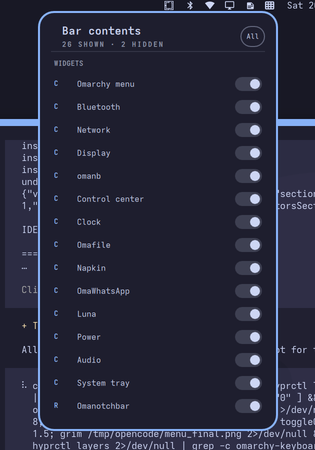

# nagualbar

The Omarchy bar, with a right-click menu for showing and hiding what is on it.

Right-click anywhere on empty bar space and you get a list of everything the bar
is drawing: your widgets, the indicator row, and each indicator on its own. Flip
a switch and that icon goes away. The widget keeps running, so flipping it back
is instant.

Hiding is not disabling. `omarchy plugin disable omarchy.clock` stops a widget
and makes it come back cold; a hidden nagualbar icon is parked at zero width with
its widget still mounted underneath.



## Install

```bash
git clone https://github.com/nagualcode/nagualbar.git
cd nagualbar
./scripts/install.sh .
```

Or straight from the remote, which clones into `~/.config/omarchy/plugins`:

```bash
curl -fsSL https://raw.githubusercontent.com/nagualcode/nagualbar/main/scripts/install.sh | bash
```

The installer:

- puts the plugin in `~/.config/omarchy/plugins/nagualbar`
- removes `omarchy.indicators` from the bar layout, recording where it was, so
  you do not end up with two indicator rows
- switches `bar.id` in `~/.config/omarchy/shell.json` to `nagualbar`

Before it edits anything it copies your `shell.json` to
`~/.config/omarchy/nagualbar-shell.json.bak`, and records what it changed in
`~/.config/omarchy/nagualbar-install.json`.

Restart your shell afterwards if the bar does not switch on its own:

```bash
omarchy-restart-shell
```

## Using it

Right-click empty bar space to open the menu. Left-drag still moves the bar, and
left-click still opens widget panels — the right-click is only on empty space, so
a click that lands on a widget is never stolen.

| Key | Does |
| --- | --- |
| Arrow keys | Move between switches |
| Tab | Move through the list |
| Enter or Space | Flip the highlighted switch |
| A | Show every icon again |
| Escape | Close |

Hidden entries stay in the list, dimmed and struck through, so a mis-click is
obvious and reversible.

`Hide indicators` at the bottom hides the whole indicator row in one go.

You can also open the menu without a mouse, which is handy for a keybinding:

```bash
omarchy-shell omarchy.bar toggleContentsMenu
```

It prints `opened`, `closed`, or `nowhere` if the bar was too full to find empty
space to anchor the menu to.

## The indicator row

nagualbar takes over Omarchy's indicators and treats them like any other icon.
All six are always on screen, with inactive ones dimmed, and each can be hidden
individually. Which section they sit in is up to you:

```json
"bar": {
  "nagualbar": { "indicators": "center" }
}
```

Valid values are `left`, `center`, `right`, and `off`. Left out, they default to
`right`. The installer keeps them wherever `omarchy.indicators` already was.

They are the stock Omarchy indicators, vendored into `indicators/`, so they keep
working against `omarchy.idle`, `omarchy.nightlight`, and
`omarchy.notifications` exactly as before. Nudge them to re-read system state
with:

```bash
omarchy-shell nagualbar.indicators refresh
```

## Windows under the bar

The first switch in the menu, under **BAR**, stops the bar from reserving screen
space. With it on, tiled and fullscreen windows line up with the top of the
screen instead of being pushed below the bar, and the bar stays drawn on top of
them.

This works because the bar is a layer surface: it only holds windows down by
claiming exclusive space. Drop the claim and windows stop making room for it,
while the surface itself is untouched and keeps painting over whatever is behind
it. Nothing is moved, restacked, or re-rendered.

It is worth it if you would rather have the full height than a bar-shaped gap,
and it costs you the top of your windows when something scrolls under the bar.

Without a mouse:

```bash
omarchy-shell omarchy.bar toggleWindowOverlap
```

It prints the state it landed on, `on` or `off`.

Note that Hyprland lays tiled windows out inside the workarea, which is derived
from the reserved area. If a window opens floating, that is your own window rule
and it is unaffected.

## Which icons are hidden

`~/.config/omarchy/nagualbar.json`, written by the bar only when a switch
actually changes:

```json
{
  "version": 2,
  "hidden": ["omarchy.audio", "Dnd"],
  "overlap": false
}
```

Keys are widget ids for widgets and indicator ids for indicators. `overlap` is
the window-overlap switch above. The file is watched, so editing it by hand takes
effect immediately. Delete it to start over. A `version: 1` file written by an
older nagualbar has no `overlap` key and reads back as off.

## Uninstall

```bash
cd nagualbar
./scripts/uninstall.sh
```

This puts `omarchy.indicators` back where it was, drops `bar.nagualbar` and
`nagualbar.indicators` from `shell.json`, restores the bar id you had before, and
switches back to `omarchy.bar`. Your hidden-icon list is kept, as
`nagualbar.json.bak`; pass `--keep-state` to leave it exactly where it is.

## Layout and widgets

nagualbar is a full bar plugin, not a widget, so it keeps the whole
`bar.layout` you already have. Add, move, and remove widgets the usual way:

```bash
omarchy bar move omarchy.clock --section right
```

Worth knowing: nagualbar adds one entry to the layout called
`nagualbar.indicators`. It is appended in memory when the bar reads its config,
so it will not appear in `shell.json` and it cannot be dragged or reordered. That
is on purpose — it is the indicator row, and the menu is the better way to
control it.

## How this relates to `omarchy.bar`

`Bar.qml` and the files in `indicators/` are derived from Omarchy's own bar
plugin, with attribution in `LICENSE`. Changes are kept to a minimum and marked
with `nagualbar` comments, so re-syncing with upstream stays tractable.

The manifest declares `omarchy.clonedFrom: "omarchy.bar"`, which is what lets
`omarchy plugin remove` put the stock bar back. For the same reason the bar's IPC
target is still `omarchy.bar`, so `omarchy-toggle-bar` and other stock tooling
keep working.
